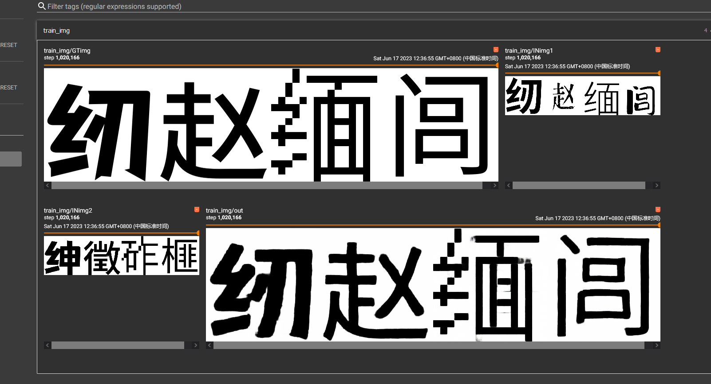
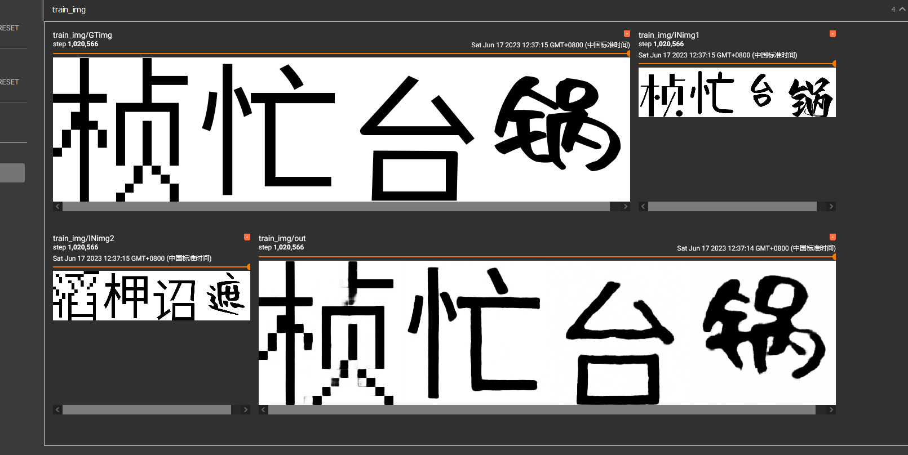
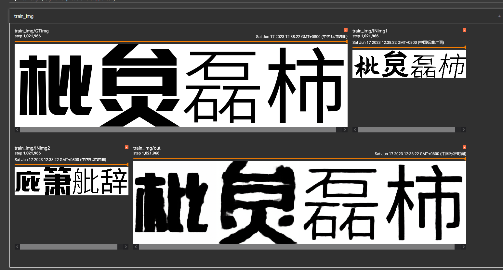
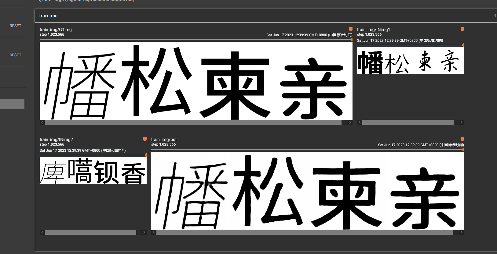

# 1
第一部分的模型基本上没问题 第二部分有算力自己试gan参数去  我去玩扩散了

# 
反正那个decode部分可以随便 接 效果都还可以 

如何食用 [cretdadta.py](cretdadta.py) data_create(w_path='V2_dast.json', map_path='映射.json', ttf_path='./tds/',out='./opp')
w _path 放你的 字笔画映射文件  我仓库里面提供了一个映射可以不用改 map path 不建议动   
‘ttf_path 发你ttf文件夹的 路径  out 这个不用说吧

如何运行他等待png生成

aaa = dastset('映射.json', 'fix1.json', './i')  这里该你数据集  fix1.json就是你的 字笔画映射文件
./i 是你的png文件路径
映射就别乱动了 除非你自己有更好的映射方案
运行[Tencode.py](Tencode.py)  就可以 训练了

要训练第二阶段的模型 你需要先训练好第一阶段
[encode_test.py](encode_test.py) 并且用这个文件提取特征

[Main_st2.py](Main_st2.py) 如何这个文件训练

有点难炼开摆  只能说效果还行 但是算不下去了

